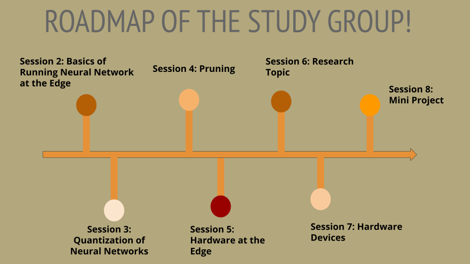
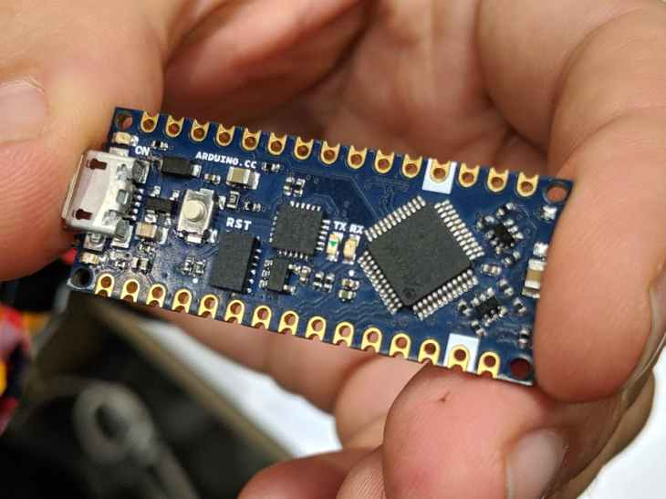
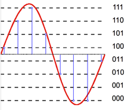
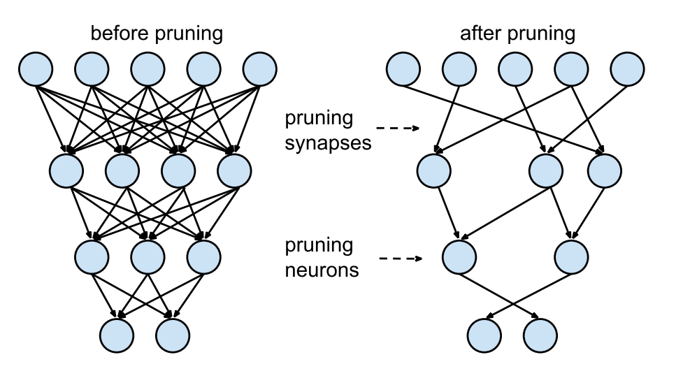
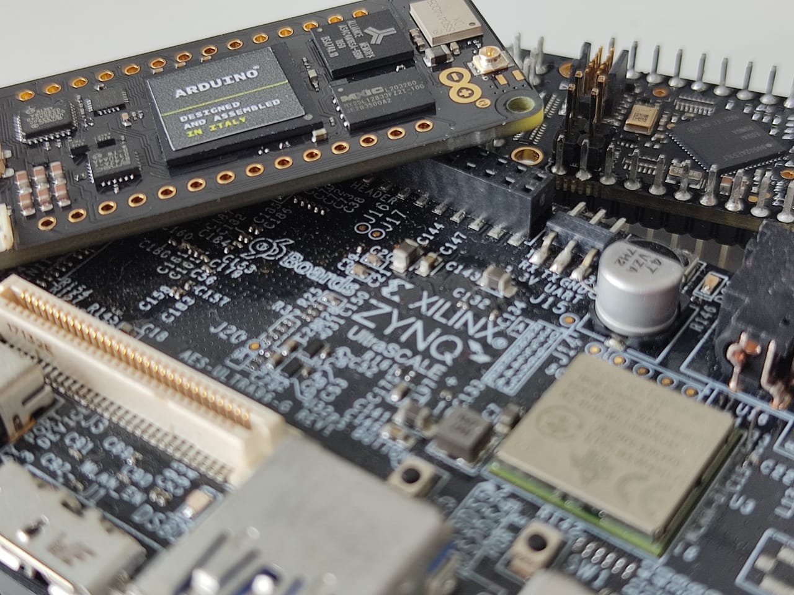

# TinyML Study Group

</a>  &nbsp;&nbsp;&nbsp; 

Welcome! This repo contains content, code & youtube recording for the Introduction to Deep Learning for Edge Devices.

#### Resources:

| | |
| ----------- | ----------- |
||**Basics of Running Neural Networks at the Edge**    This talk we will explain about edge performance metrics, like Latency, Throughput, Size, FLOPS and with other Metrics. We also cover which metrics to optimise your network for.  |
  
| | |
| ----------- | ----------- |
||**Quantization**    This session we will go over Quantization and types of Quantization(Weight and Activation based).Following this we will look into the reasons for applying quantization for the edge. Finally we will gover demo of using Quantization using TFLite and running a quantized netowrk on a hardware.  |
  
| | |
| ----------- | ----------- |
||**Pruning**    This talk will cover Pruning and Different Pruning Methoda. Similar to the Quantization session, we will look into pruning using TFLite and also see how Pruning helps to improve performance on the edge. Lastly we will go over measuring Pruning Performance  |
  
  
| | |
| ----------- | ----------- |
||**Choosing the Right Hardware**    In this specific webinar we will see how to choose the right hardware. We will look into different types of hardware and why hardware should not be an afterthought. We will look into different scenarios and pick a hardware for each scenario  |

| | |
| ----------- | ----------- |
||**Research Paper Reading**    Research Paper Reading is an important aspect to Edge Computing. In this session, we will look into how to read a research paper, what are the different parts of a Research paper, How to find good research Papers. We will also go through two research paper explaination examples  |
  
| | |
| ----------- | ----------- |
||**Hardware Devices**   In this last content session, we will close our study group with how to get started on your Project. We will look into Hardware Devices and demo using a Neural Compute Stickj and Edge TPU Board. Lastly we will also go through research paper reading for hardware implementations.  |

